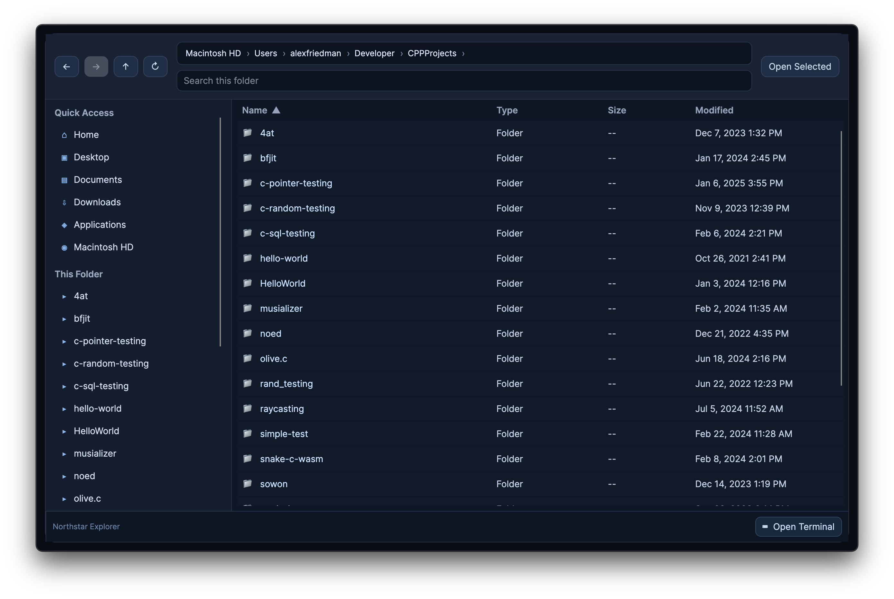

# Northstar Explorer

Northstar is a macOS-focused file explorer built with Avalonia UI, inspired by Windows Explorer interactions.



## Releases

Download prebuilt macOS app bundles from GitHub Releases:

- https://github.com/brooklynDev/Northstar/releases

On macOS, before first run, remove quarantine attributes:

```bash
xattr -dr com.apple.quarantine "Northstar Explorer.app"
```

## What It Does

- Dark, desktop-style file browser UI
- Quick access sidebar + folder listing
- Breadcrumb/path bar (clickable, editable)
- Spacebar quick preview for images/text/PDF (auto-hides when unsupported)
- Sortable columns: Name, Type, Size, Modified
- Explorer-style keyboard behavior:
  - Type-to-select
  - `Enter` to open
  - `Backspace` to go back
- Context menu + shortcuts (`Cmd/Ctrl + C/X/V`, `Delete`, `Cmd/Ctrl + Shift + N`)
- Auto-refresh when files change in the current folder
- Embedded terminal pane (toggle from footer):
  - Uses the user's shell (`$SHELL`) as a login shell
  - ANSI color output rendering
  - Case-insensitive tab completion with cycling
  - `cd` in terminal automatically syncs explorer folder
- External terminal fallback if embedded terminal startup fails

## Requirements

- macOS
- .NET SDK 10

## Quick Start

```bash
make run
```

## Build

```bash
make build
```

## Publish (macOS app bundles)

```bash
make publish
```

Artifacts are written to:

- `artifacts/osx-arm64/Northstar Explorer.zip`
- `artifacts/osx-x64/Northstar Explorer.zip`

Each zip unpacks to a single `.app` bundle.
